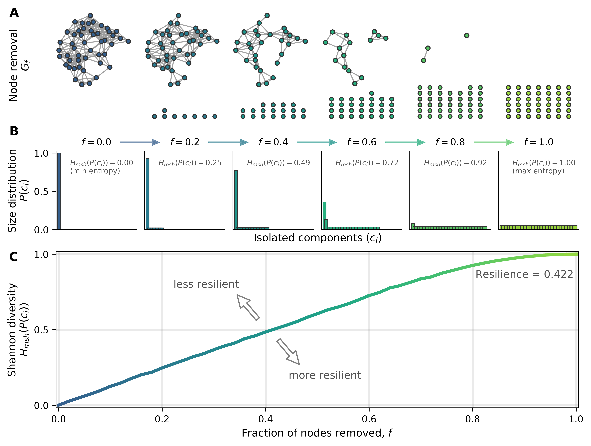
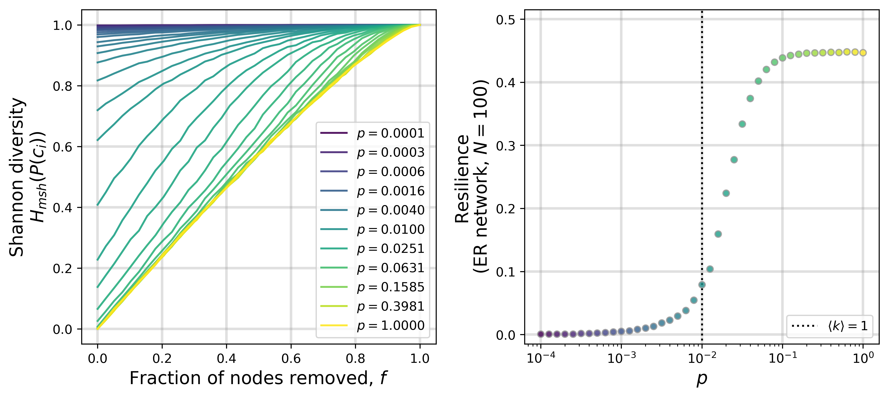

# The prospective resilience of (protein) networks

Python code for calculating the resilience and the *prospective resilience*
in networks. This code accompanies the recent paper: 

**Resilience and evolvability of protein-protein interaction networks**. by
Brennan Klein, Ludvig Holmér, Keith M. Smith, Mackenzie M. Johnson, Anshuman
Swain, Laura Stolp, Ashley I. Teufel, and April S. Kleppe. (2020).

- - - -

<p align="center">

</p>

**<p align="center">Fig. 1: Schematic of network resilience.</center>**

<p align="center">

</p>

**<p align="center">Fig. 2: The effect of network density on resilience.**

- - - -

## Analysis Notebooks
1. [01_Intro_Network_Resilience](https://nbviewer.jupyter.org/github/jkbren/presilience/blob/master/code/01_Intro_Network_Resilience.ipynb)
2. [02_Protein_Network_Resilience](https://nbviewer.jupyter.org/github/jkbren/presilience/blob/master/code/01_Intro_Network_Resilience.ipynb)
3. [03_Prospective_Resilience](https://nbviewer.jupyter.org/github/jkbren/presilience/blob/master/code/01_Intro_Network_Resilience.ipynb)


## Installation and Usage

In order to use this code, first clone/download the repository. 
Below is a simple example usage. Please feel free to reach 
out if you find any bugs, have any questions, or if for some reason
the code does not run. 

## Requirements  <a name="requirements"/>

This code is written in [Python 3.x](https://www.python.org) and uses 
the following packages:

* [NetworkX](https://networkx.github.io)
* [Scipy](http://www.scipy.org/)
* [Numpy](http://numpy.scipy.org/)
* And for replicating figures, you will need:
    + [matplotlib](https://matplotlib.org)
    + [Pandas](https://pandas.pydata.org/)

The colormaps in the paper are from [https://matplotlib.org/cmocean/](https://matplotlib.org/cmocean/)
and the named colors are from [https://medialab.github.io/iwanthue/](https://medialab.github.io/iwanthue/).

## Citation   <a name="citation"/>

If you use these methods and this code in your own research, please cite our paper:

Klein, B., Holmér, L., Smith, K., Johnson, M., Swain, A., Stolp, L.,
Teufel, A., and Kleppe, A. (2020).
**Capturing the evolutionary capacity to innovate via novel interactions
in protein-protein interaction networks.**


Bibtex: 
```text
@article{klein2020presilience,
  title = {Resilience and evolvability of protein-protein interaction networks},
  author = {Klein, Brennan and Holmér, Ludvig and Smith, Keith M. and Johnson, Mackenzie M.\
    and Swain, Anshuman and Stolp, Laura and Teufel, Ashley I. and Kleppe, April S.},
  journal = {arXiv preprint XXX},
  year = {2020}
}
```

## See also:

* Zitnik, M., Sosič, R., Feldman, M.W., and Leskovec, J. (2019). **Evolution of
resilience in protein interactomes across the tree of life**. *Proceedings of
the National Academy of Sciences*. 116, 10, 4426–4433. 
doi:[10.1073/pnas.1818013116](https://www.pnas.org/content/116/10/4426).
    + recent work introducing the *network resilience* measure used here,
    showing that the resilience of protein-protein interactomes increases
    across the tree of life.
